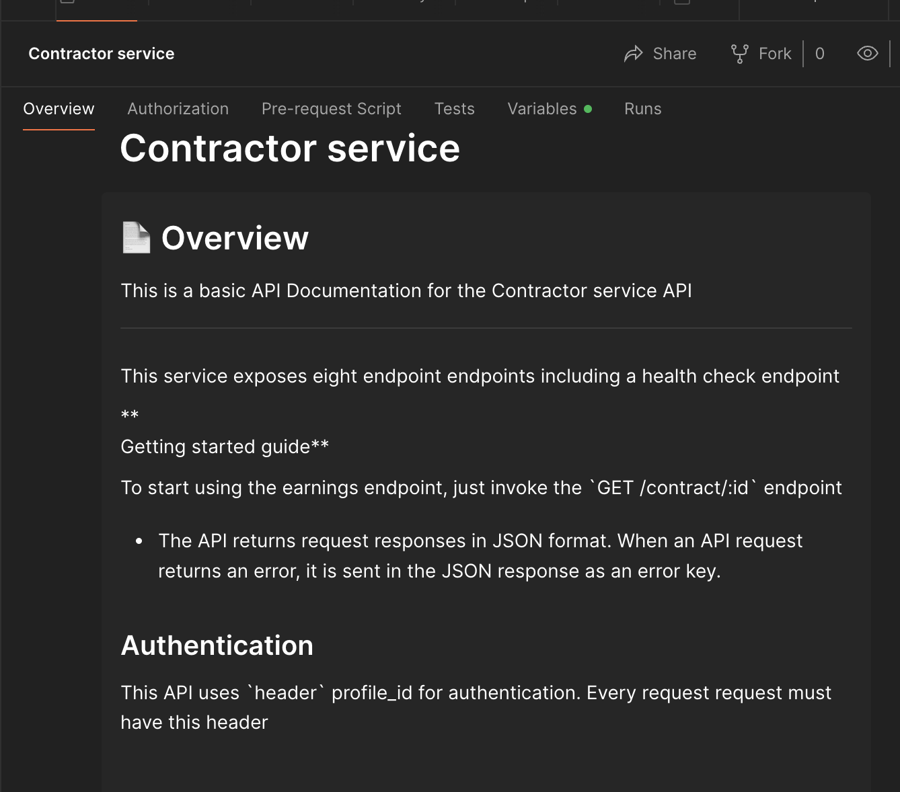

# DEEL BACKEND TASK

💫 Welcome! 🎉

This backend exercise involves building a Node.js/Express.js app that will serve a REST API
This API has been deployed and is available for easy usage here: https://contractor-service-1vz5.onrender.com

`Note`: More on deployment later

## Getting Set Up

The exercise requires [Node.js](https://nodejs.org/en/) to be installed. We recommend using the LTS version.

1. Start by creating a local repository for this folder.

1. In the repo root directory, run `npm install` to gather all dependencies.

1. Next, `npm run seed` will seed the local SQLite database. **Warning: This will drop the database if it exists**. The database lives in a local file `database.sqlite3`.

1. Then run `npm start` which should start both the server and the React client.

- The server is running on port 3001.

## APIs To Implement
Check `PROBLEM_STATEMENT.md` to go over the required APIs

## Usage - API Overview
Checkout [this API Documentation](https://www.postman.com/galactic-trinity-524631/workspace/measure-contractor-service/documentation/707394-b60c2182-726b-4dfb-92ce-39d1e9961eb2) (with examples) to quickly invoke the earnings endpoint
`Note`: You can fork the collection to send requests via Postman



# Implementation: Key Ideas and Interfaces
The project has been built around the idea of keeping it simple and extensible

- Routes and controllers are defined in app.js
- Contractor, job and profile related methods have been abstracted away to `ContractService.js` allowing code re-use and following single responsibility principle
- Pay endpoint implements a full pay or no pay scheme. Partial payments are not supported.
- Deposit endpoint: I was a bit confused about the requirements for this. Felt like current balance should also be taken into account if we're restricting the amount that can be deposited. But in the end, just stuck to the requirements
- Inline ToDos highlight some of the improvements that can be done


### Reliability and user experience

- `Error handling`: `Errors.js` defines custom errors and standardizes error response for the API client.
Simple error schema
```json
{
    "code": 404 //status code
    "error": {
        "code": "NotFound", // easy to identify error code for debugging
        "message": "Meaningful error message",
        "detail": "Pointed error reason to help clients"
    }
}
```

- `Tests`: Automated tests that can be extended to cover more endpoints. Uses `https://jestjs.io/` for authoring tests


## Deployment

- This NodeJS service is public and deployed using `render`. 
`Note: Free instance types will spin down with inactivity. Instances re-spawn on request. So it might take a little longer for the first request to get served`

- Deployment is on free tier and therefore uses a single instance.

- Render is configured to use the `/health` endpoint as the healthcheck endpoint ensuring [zero downtime deployment](https://docs.render.com/deploys#zero-downtime-deploys)

- Render automatically ensures 
    - Basic [DDoS protection](https://docs.render.com/ddos-protection)

    - App restarts if app crashes

- Unit tests run on every push to `main` branch using Github actions as a pre-commit hook


## Maintainability

- Simple project structure for easy extensibility

- Test setup and partial coverage that can be extended

- A basic CI/CD Pipeline that runs the tests on PR and merge

- Small/modular methods and functions with JSDoc

- Custom errors to handle possible errors. Easy to extend error framework

- Basic linting is configured using ESLint with rules listed down in `.eslintrc`

## Data Models

> **All models are defined in src/model.js**

### Profile

A profile can be either a `client` or a `contractor`.
clients create contracts with contractors. contractor does jobs for clients and get paid.
Each profile has a balance property.

### Contract

A contract between and client and a contractor.
Contracts have 3 statuses, `new`, `in_progress`, `terminated`. contracts are considered active only when in status `in_progress`
Contracts group jobs within them.

### Job

contractor get paid for jobs by clients under a certain contract.